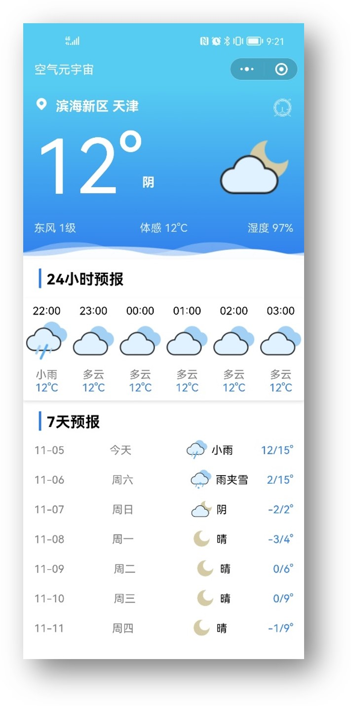
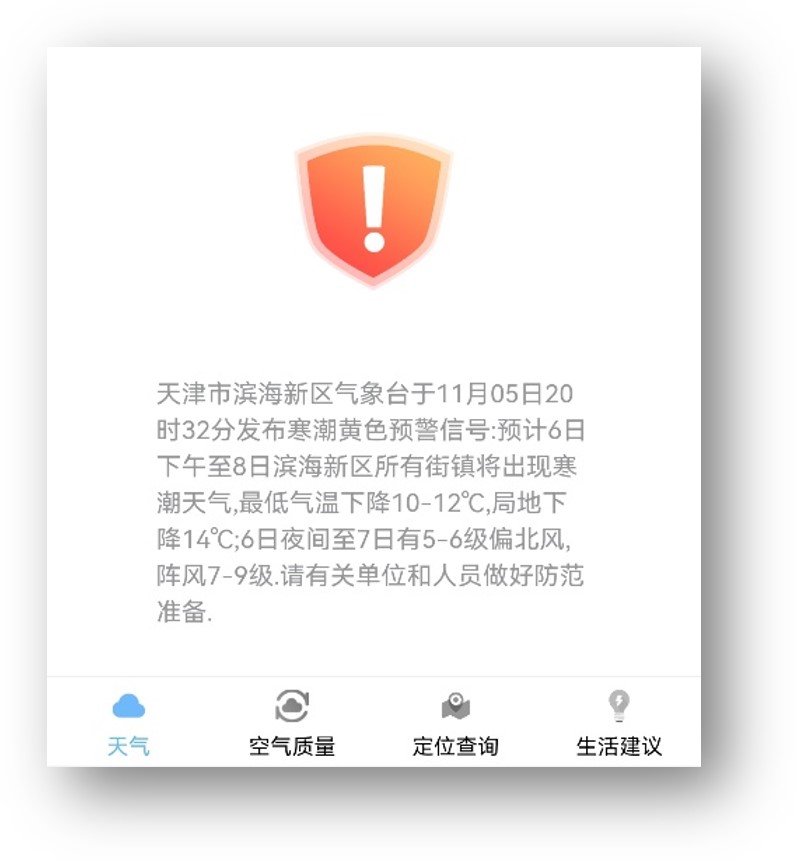
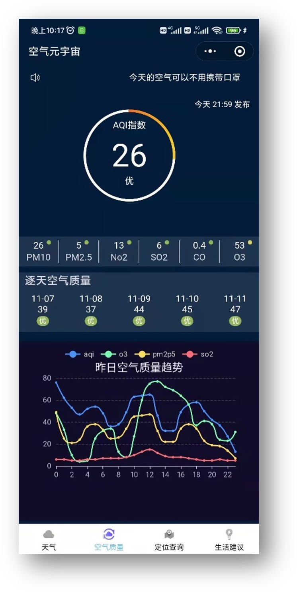
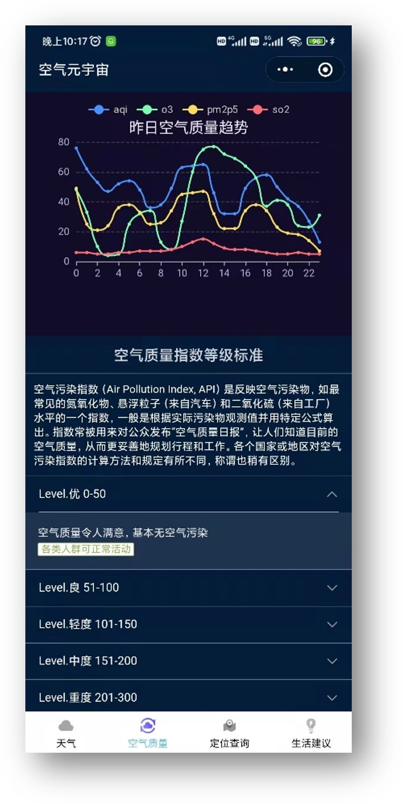
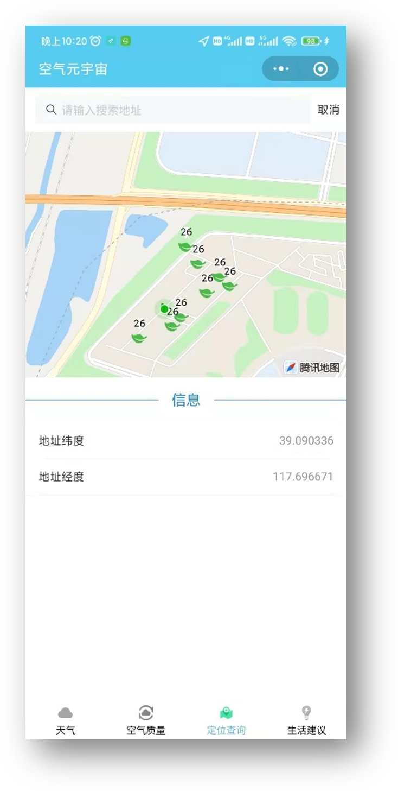
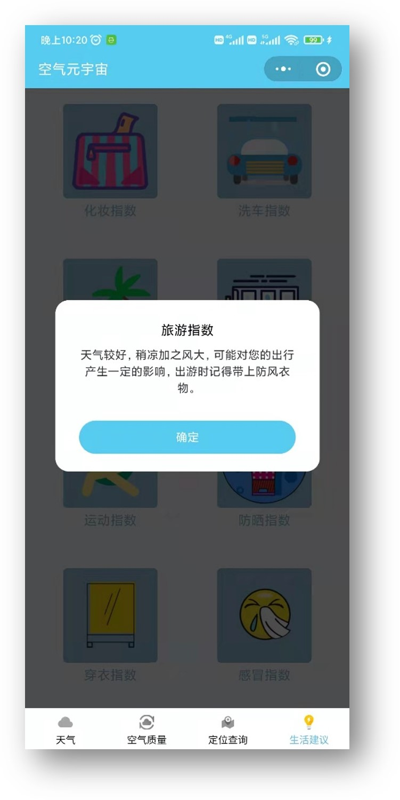

# 空气物语
## 功能介绍
“空气物语”是一款在现有技术的基础上，调综合调用了多类别API接口并融合先进的深度学习算法，更加精准的预测未来空气质量污染指数以及天气状况的小程序。
小程序的主要功能包括：天气预报模块，为用户提供未来24小时和七天内的天气状况、当前温度、体感温度、灾害预警等信息；空气质量模块，展示当前的空气质量AQI指数、6种污染物浓度，以及未来五天的空气质量预测，并用echart绘制昨日空气质量趋势曲线图，包括PM2.5、臭氧等指数；定位查询模块，提供地图搜索功能，用户可以定点查询区域的AQI指数信息;增值服务模块，平台提供运动、洗护、化妆、交通等多项指数和生活建议。这些功能利用了高精度的预测技术，不仅能保证给用户传递有效的信息，也能在多变的环境下使用户及时的掌握空气状况。
平台的预测信息提供小时间级别的精细化预测和中长期预报，根据小程序提供的信息，可以针对不同的人群种类发布不同的预警信息，以此为依据，做好有针对性的防范工作。是一款准确度高、功能齐全、一站式查询的在线预警平台。

## 演示图

